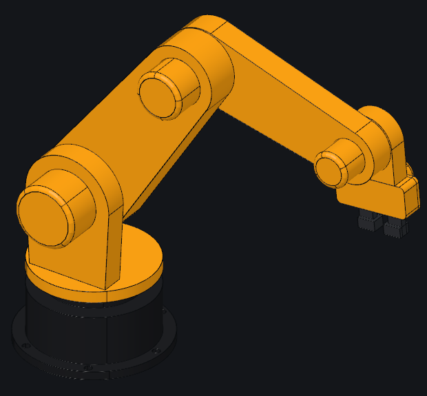
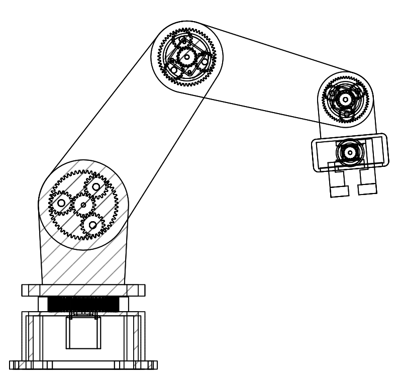

# gcad

Parametric CAD written like G-code: one operation per line, built for agents to write
and check.
It is pure Rust on the [monstertruck](https://github.com/v0l/monstertruck) B-rep
kernel and exports STEP, STL, OBJ, 3MF and SVG drawings.

```
let w=40 h=30 t=3
rect w h r=4
base: extrude t
plane base.end
mounts: hole 3.2 15,10 -15,10 -15,-10 15,-10
fillet 0.8 base.end&base.side
chamfer 0.3 mounts.side&base.end
```

## Install

```sh
curl -fsSL https://raw.githubusercontent.com/v0l/gcad/master/install.sh | sh
```

That puts the latest release in `~/.local/bin` on Linux and macOS. Windows builds are zips
on the [releases page](https://github.com/v0l/gcad/releases).

## Use

```
gcad check examples/parts/plate.gcad
gcad render examples/parts/plate.gcad plate.png
gcad export examples/parts/plate.gcad plate.step
gcad bom examples/assemblies/enclosure.gasm
gcad examples/assemblies/enclosure.gasm
gcad examples/robot/arm.gasm
gcad docs
```

Part files (`.gcad`) build one or more bodies. Assembly files (`.gasm`) bring parts in
from part files, place them, join them with turning and sliding joints and check
that they do not overlap.

`examples/robot/arm.gasm` is a robot arm built the way industrial arms are: each
joint has a motor on its axis under a round cover, driving a planetary reducer
enclosed in the joint housing. The ring gear is cut into the housing, the sun sits on
the motor shaft, and the three planets turn on pins of the next link, which is the
reducer's output. The gripper's fingers are racks on one pinion inside its housing.
Drag the joint sliders in the viewer and every sun and planet turns at its ratio; the
explode slider and the section tool show the gears inside.




With no command, `gcad` opens the viewer: a live view of the file that rebuilds on
save, with a view cube, measuring, and sliders for an assembly's joints.

The format, operations and selectors are in [docs/format.md](docs/format.md), which
`gcad docs` prints. Which CAD
operations exist, which are still missing and the tests behind each are in
[docs/ops.md](docs/ops.md).

## Agent skill

[skills/gcad/SKILL.md](skills/gcad/SKILL.md) teaches an agent the write, check, render loop,
the selectors, assemblies and the traps. It ships in every release archive; link the
`skills/gcad` directory into your agent's skills folder.

## Building

The kernel is a fork of [monstertruck](https://github.com/v0l/monstertruck) with fillet and
boolean fixes. Check out its `cad-regressions` branch next to this repo; `Cargo.toml` wires
it in through `[patch.crates-io]` by path.

```sh
git clone https://github.com/v0l/gcad
git clone -b cad-regressions https://github.com/v0l/monstertruck
cd gcad && cargo build --release
```

Releases build the fork at the commit pinned in `.github/workflows/release.yml`
(`MONSTERTRUCK_REV`). Push a `v*` tag to build Linux, macOS and Windows archives and publish
them as a GitHub release.

## License

GPL-3.0-or-later.
